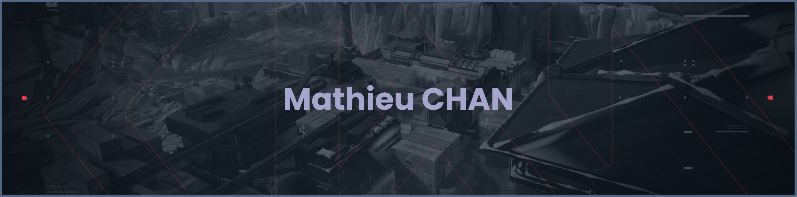

- 👋 Hi, I’m @Matchi1
- 👀 I’m interested in Haskell (currently), C
- 🌱 I’m currently learning Haskell, embedded system
- 📫 How to reach me mathieu1.chan@gmail.com

<!---
Matchi1/Matchi1 is a ✨ special ✨ repository because its `README.md` (this file) appears on your GitHub profile.
You can click the Preview link to take a look at your changes.
--->   

## Languages

  
  
  
  
  
  

